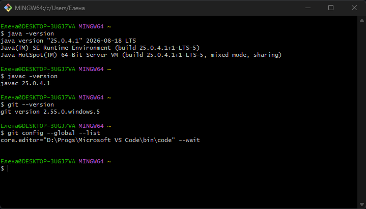
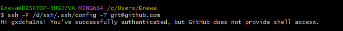
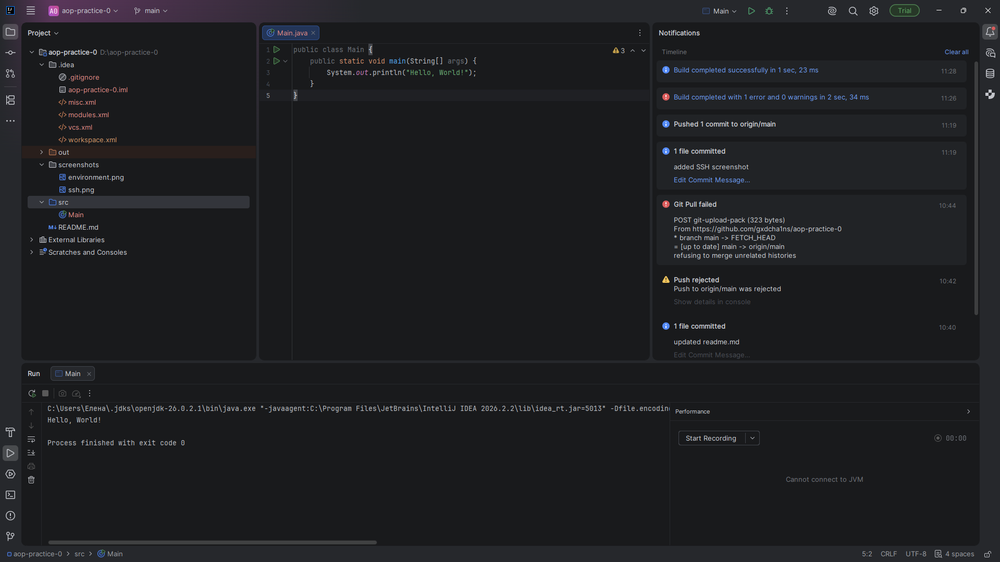
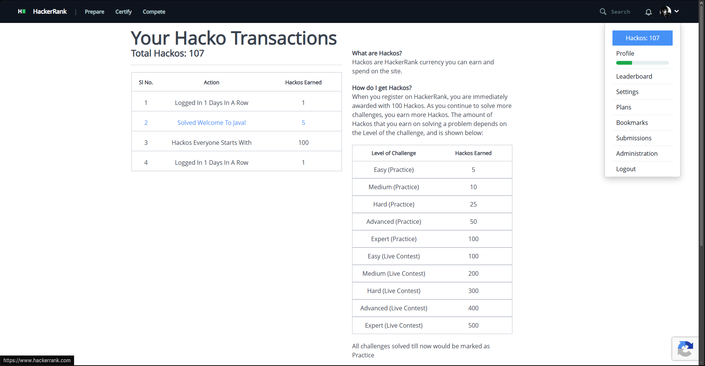
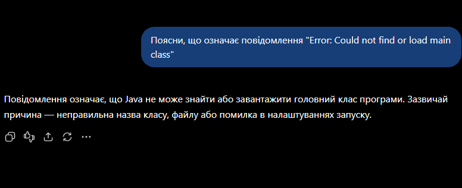

# Практична робота №0

## Налаштування середовища розробки

**Прізвище, ім'я:** Кочерга Владислав
**Група:** 213
**Номер заняття:** 0
**Тема заняття:** Налаштування середовища розробки

---

## 1. Профілі

* **GitHub:** [@gxdcha1ns](https://github.com/gxdcha1ns)
* **LeetCode:** [@gxdcha1ns](https://leetcode.com/u/gxdcha1ns/)
* **HackerRank:** [@kocherha_vladys1](https://www.hackerrank.com/profile/kocherha_vladys1)

---

## 2. Перевірка середовища

Для перевірки встановлених інструментів було виконано такі команди:

java -version
javac -version
git --version
git config --global --list


**Результат:**



---

## 3. Перевірка SSH-з'єднання

Для перевірки SSH-з'єднання з GitHub було виконано команду:


ssh -T git@github.com


**Результат:**



---

## 4. Hello, World! в IntelliJ IDEA

В IntelliJ IDEA було створено та успішно виконано програму **Hello, World!**

**Результат виконання:**



---

## 5. Welcome to Java! на HackerRank

На платформі HackerRank було успішно розв'язано задачу **Welcome to Java!**

**Результат:**



---

## 6. AI-інструменти

### ChatGPT

Було виконано навчальний запит до ChatGPT.

**Навчальний запит:**

> `<Поясни, що означає повідомлення "Error: Could not find or load main class".>`

**Відповідь:**



### Claude Code

> **Примітка:** `<Доступ до Claude Code не оформлювався.>`

---

## 7. Проблеми під час встановлення

Під час налаштування середовища виникла проблема: команди `java` та `javac` не розпізнавалися в PowerShell.

Проблему було усунуто шляхом налаштування змінних середовища.

**Змінна `JAVA_HOME`:**

```text
C:\Program Files\Java\jdk-25
```

До змінної `Path` було додано:

```text
%JAVA_HOME%\bin
```

Після перезапуску PowerShell команди `java -version` та `javac -version` почали працювати коректно.

---

## 8. Висновок

У ході практичної роботи було налаштовано середовище розробки, перевірено встановлення Java JDK та Git, а також налаштовано SSH-з'єднання з GitHub.

Було успішно виконано програму **Hello, World!** в IntelliJ IDEA та розв'язано задачу **Welcome to Java!** на HackerRank. Також було перевірено використання AI-інструментів у навчальному процесі.
